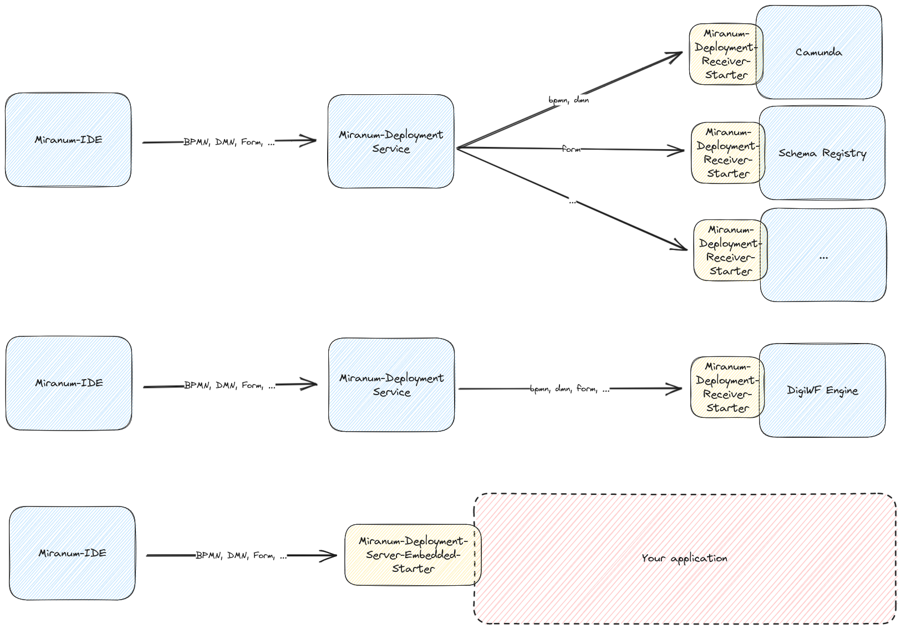

[Miranum Deployment](https://github.com/Miragon/miranum-ide/tree/main/spring-boot-apps/miranum-deployment) consists of two parts. The Miranum Deployment Server and the Miranum Deployment Receiver.
The Miranum Deployment Server is a Spring Boot application that provides a REST API to deploy process artifacts to
Spring applications that use the Miranum Deployment Receiver library.



## Usage

We provide Spring Boot starters for the Miranum Deployment Server and the Miranum Deployment Receiver.
Additionally, we provide the Miranum Deployment Service with a ready to go spring boot application.

### Miranum Deployment Service

The Miranum Deployment Service is a ready to go Spring Boot application that provides the
Miranum Deployment Server with a REST implementation.
Therefore, it uses the REST starters to transfer the process artifacts to the Miranum Deployment Receiver.

We also provide a docker image for the Miranum Deployment Service. You can find it
on [Docker Hub](https://hub.docker.com/r/miragon/miranum-deployment-service).

#### Configurations

The general configuration of the Miranum Deployment Service is done via the application.yml file.
Under the property `io.miranum.deploymentserver.rest` you can configure the REST implementation.

```yaml
io:
    miranum:
        deploymentserver:
            rest:
                enabled: true
                targets:
                    dev:
                        bpmn: '${MIRANUM_DEPLOYMENT_SERVER_BPMN_DEV_URL}:${MIRANUM_DEPLOYMENT_SERVER_BPMN_DEV_PORT}/rest/deployment'
                        dmn: '${MIRANUM_DEPLOYMENT_SERVER_DMN_DEV_URL}:${MIRANUM_DEPLOYMENT_SERVER_DMN_DEV_PORT}/rest/deployment'
                        form: '${MIRANUM_DEPLOYMENT_SERVER_FORM_DEV_URL}:${MIRANUM_DEPLOYMENT_SERVER_FORM_DEV_PORT}/rest/deployment'
                        config: '${MIRANUM_DEPLOYMENT_SERVER_CONFIG_DEV_URL}:${MIRANUM_DEPLOYMENT_SERVER_CONFIG_DEV_PORT}/rest/deployment'
```

**Preconfigured values**

Values for the stages dev, test and prod are already preconfigured. You can use them as they are or you can overwrite
them.

| Property                                   | Value            |
|--------------------------------------------|------------------|
| MIRANUM_DEPLOYMENT_SERVICE_PORT            | 8080             |
| MIRANUM_DEPLOYMENT_SERVER_BPMN_DEV_URL     | http://localhost |
| MIRANUM_DEPLOYMENT_SERVER_BPMN_DEV_PORT    | 9001             |
| MIRANUM_DEPLOYMENT_SERVER_DMN_DEV_URL      | http://localhost |
| MIRANUM_DEPLOYMENT_SERVER_DMN_DEV_PORT     | 9001             |
| MIRANUM_DEPLOYMENT_SERVER_FORM_DEV_URL     | http://localhost |
| MIRANUM_DEPLOYMENT_SERVER_FORM_DEV_PORT    | 9001             |
| MIRANUM_DEPLOYMENT_SERVER_CONFIG_DEV_URL   | http://localhost |
| MIRANUM_DEPLOYMENT_SERVER_CONFIG_DEV_PORT  | 9001             |
| MIRANUM_DEPLOYMENT_SERVER_BPMN_TEST_URL    | http://localhost |
| MIRANUM_DEPLOYMENT_SERVER_BPMN_TEST_PORT   | 9001             |
| MIRANUM_DEPLOYMENT_SERVER_DMN_TEST_URL     | http://localhost |
| MIRANUM_DEPLOYMENT_SERVER_DMN_TEST_PORT    | 9001             |
| MIRANUM_DEPLOYMENT_SERVER_FORM_TEST_URL    | http://localhost |
| MIRANUM_DEPLOYMENT_SERVER_FORM_TEST_PORT   | 9001             |
| MIRANUM_DEPLOYMENT_SERVER_CONFIG_TEST_URL  | http://localhost |
| MIRANUM_DEPLOYMENT_SERVER_CONFIG_TEST_PORT | 9001             |
| MIRANUM_DEPLOYMENT_SERVER_BPMN_PROD_URL    | http://localhost |
| MIRANUM_DEPLOYMENT_SERVER_BPMN_PROD_PORT   | 9001             |
| MIRANUM_DEPLOYMENT_SERVER_DMN_PROD_URL     | http://localhost |
| MIRANUM_DEPLOYMENT_SERVER_DMN_PROD_PORT    | 9001             |
| MIRANUM_DEPLOYMENT_SERVER_FORM_PROD_URL    | http://localhost |
| MIRANUM_DEPLOYMENT_SERVER_FORM_PROD_PORT   | 9001             |
| MIRANUM_DEPLOYMENT_SERVER_CONFIG_PROD_URL  | http://localhost |
| MIRANUM_DEPLOYMENT_SERVER_CONFIG_PROD_PORT | 9001             |

### Miranum Deployment Server

The Miranum Deployment Server is a single API for the *Miranum-IDE* to deploy process artifacts to.
It transfers the process artifacts to applications which implement the Miranum Deployment Receiver library.

#### Miranum Deployment Server REST

:::info 
A full example is available in the [miranum-deployment-service](https://github.com/Miragon/miranum-ide/tree/main/spring-boot-apps/miranum-deployment/miranum-deployment-service) module.
:::

1. Add the Miranum Deployment Server REST starter to your spring application.

```xml

<dependency>
    <groupId>io.miragon.miranum</groupId>
    <artifactId>miranum-deployment-server-rest-starter</artifactId>
    <version>${project.version}</version>
</dependency>
```

2. Configure the Miranum Deployment Server REST targets.

```yaml
io:
    miranum:
        deploymentserver:
            rest:
                enabled: true
                targets:
                    dev:
                        bpmn: 'http://localhost:9001/rest/deployment'
                        dmn: 'http://localhost:9001/rest/deployment'
                        form: 'http://localhost:9001/rest/deployment'
                        config: 'http://localhost:9001/rest/deployment'
                    test:
                        bpmn: 'http://localhost:9002/rest/deployment'
                        dmn: 'http://localhost:9003/rest/deployment'
                        form: 'http://localhost:9004/rest/deployment'
                        config: 'http://localhost:9005/rest/deployment'
```

#### Miranum Deployment Server Embedded

In case you have a single spring application you can use the Miranum Deployment Server Embedded starter.
It provides the Miranum Deployment Server as well as a build in Miranum Deployment Receiver implementation.

> A full example is available in the [miranum-deployment-example](https://github.com/Miragon/miranum-ide/tree/main/spring-boot-apps/miranum-deployment/miranum-deployment-example) module.

##### Usage

1. Add the Miranum Deployment Server Embedded starter to your spring application.

```xml

<dependency>
    <groupId>io.miragon.miranum</groupId>
    <artifactId>miranum-deployment-server-embedded-starter</artifactId>
    <version>${project.version}</version>
</dependency>
```

2. Implement the `MiranumDeploymentReceiver` interface and provide it as spring bean.

```java
import io.miragon.miranum.deploymentreceiver.application.ports.out.MiranumDeploymentReceiver;
import org.springframework.stereotype.Component;

import java.util.List;

@Component
public class ExampleDeploymentReceiver implements MiranumDeploymentReceiver {

    @Override
    public void deploy(final Deployment deployment, final List<String> tags) {
        // TODO: Implement your deployment logic here
    }

}
```

### Miranum Deployment Receiver

Add the Miranum Deployment Receiver REST starter to each spring application that should deploy process artifacts.
In the Miranum Deployment Server you can configure the target applications via the application.yml file.

> A full example is available in the [miranum-deployment-example](https://github.com/Miragon/miranum-ide/tree/main/spring-boot-apps/miranum-deployment/miranum-deployment-example) module.

#### Usage

1. Add the Miranum Deployment Receiver REST starter to your spring application.

```xml

<dependency>
    <groupId>io.miragon.miranum</groupId>
    <artifactId>miranum-deployment-receiver-rest-starter</artifactId>
    <version>${project.version}</version>
</dependency>
```

2. Implement the `MiranumDeploymentReceiver` interface and provide it as spring bean.

```java
import io.miragon.miranum.deploymentreceiver.application.ports.out.MiranumDeploymentReceiver;
import org.springframework.stereotype.Component;

import java.util.List;

@Component
public class ExampleDeploymentReceiver implements MiranumDeploymentReceiver {

    @Override
    public void deploy(final Deployment deployment, final List<String> tags) {
        // TODO: Implement your deployment logic here
    }

}
```

## Java 11 and Spring Boot 2 support

Miranum Deployment supports Spring Boot 2 (and Java 11) until version 0.2.x.
With version 0.3.0 the support for Spring Boot 2 (and Java 11) will be dropped.
