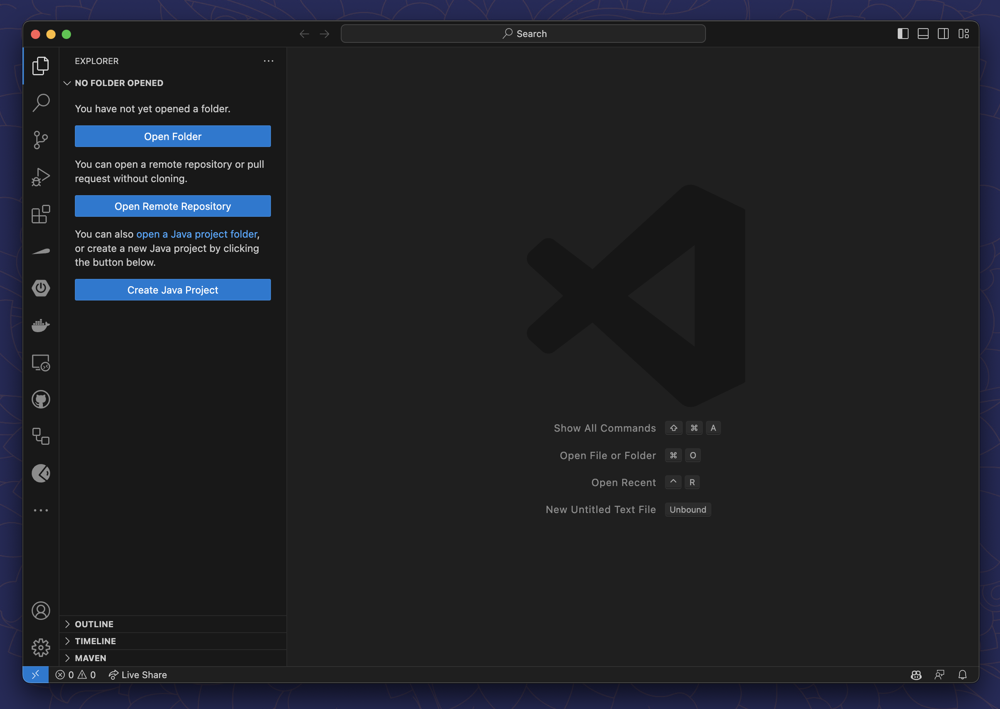
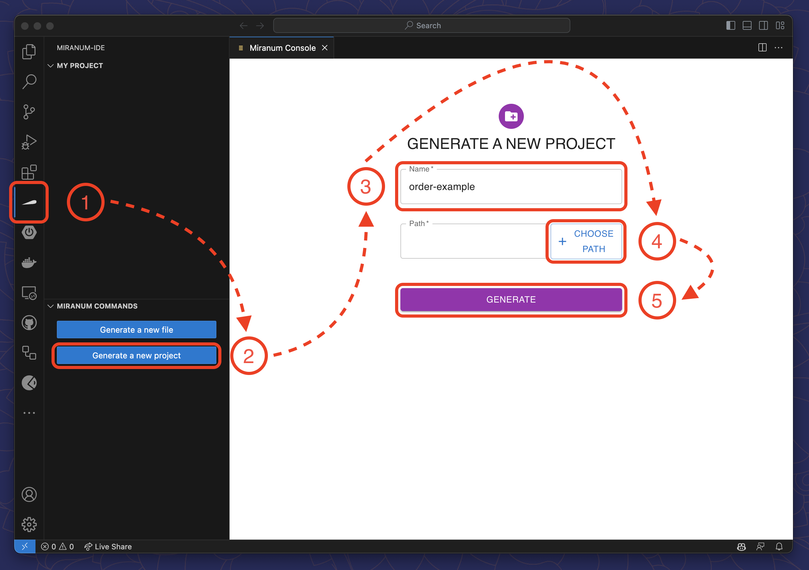
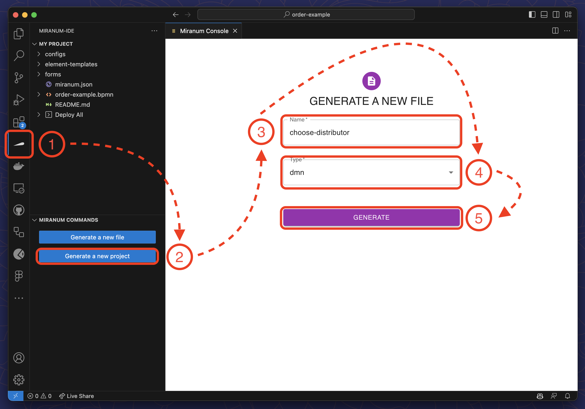

# Miranum Console Quickstart Guide

**Miranum Console** is one component of the Miranum IDE.
It provides a UI that helps you to scaffold a new digitization project.

:::info What You Will Learn
- [How to create a new project](#create-a-new-project)
- [How to generate a process artifact](#generate-a-process-artifact)
:::

## Create a new Project

We start with an empty workspace in VS Code.
So your Screen should look something like this:

To create a new project, follow these steps:
1. Select the Miranum Console view in the Activity Bar on the left side of VS Code.
2. Click on `Generate a new project` in the bottom left corner of the view.
3. Enter a name for your project.
4. Select a location for your project.
5. Click on `Generate`.

After a few seconds, the project and workspace are created.

Miranum Console will generate the following files and folders:

:::note
BPMN diagrams must be created for the process engine they intend to be deployed on.
Right now (v0.5.3) the generated BPMN diagrams are only compatible with **Camunda 7**.
:::

* `miranum.json` - The project configuration file
* `.bpmn` - The BPMN diagram for **Camunda 7**
* `/forms` - The folder for your forms
* `/element-templates` - The folder for your element templates
* `/configs` - The folder for your configuration files

We will explore these files and folders in more detail in the following guides.

## Generate a Process Artifact

If your project needs more artifacts, you can generate them with **Miranum Console**.
1. Select the Miranum Console view in the Activity Bar on the left side of VS Code.
2. Click on `Generate a new file` in the bottom left corner of the view.
3. Enter a file name
4. Select the type of the file you want to generate
5. Click on `Generate`

Now you should have all necessary files ready to start modeling the process with the **Miranum Modeler**
in the [next step](create-process.md).
