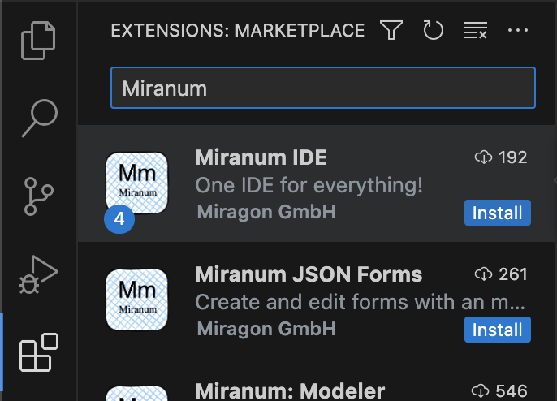

# Miranum IDE Quickstart Guide

Welcome to the Quickstart Guide for **Miranum IDE**, a collection of VS Code Plugins that allows you to initialize, edit,
manage and access all artifacts for your process application in one place.

:::info What you will learn
In this guide, you'll get hands-on experience with the following core features of Miranum IDE:
- [Initializing a Project](initialize-project.md)
- [Creating a BPMN Process](create-process.md)
- [Creating a Business Rule]
- [Creating a Form]
:::

:::caution Early Stage of Development
Miranum IDE is currently in the early stages of development.
We are working hard to bring you a stable and feature-rich experience, but you may encounter bugs or missing features.
If you do, please let us know by [raising an issue](https://github.com/Miragon/miranum-ide/issues) on our GitHub repository.
If you are interested in upcoming features, you can also check out our [Project Board](https://github.com/orgs/Miragon/projects/9/views/3?filterQuery=repo%3A%22Miragon%2Fmiranum-ide%22).
:::

Each of these mini-guides will help you get started quickly, providing you with a firm understanding of the basics.

In addition to this quickstart guide, we've also developed a [Showcase](../../showcases/miranum-stack/miranum-stack-showcase.md).
This showcase will demonstrate how the Miranum IDE can be used in conjunction with our various Miranum tools to help you create a simple process application.
We will use the same process example in our guides.
You can find all the files [here](https://github.com/Miragon/miranum-consulting/tree/main/miranum-stack-showcase/order-example/order-example-camunda7/src/main/resources).
The process is kept simple and does not represent a real-world use case, focusing on the capabilities of the Miranum IDE.
But we are curious to see what you can build with it and hear your [feedback](https://marketplace.visualstudio.com/items?itemName=miragon-gmbh.miranum-ide&ssr=false#review-details)!

You will need to install the Miranum IDE before diving into the tutorials.
1. Install [VS Code](https://code.visualstudio.com/download)
2. Open the *Extensions* view in VS Code and search for `Miranum` and install the **Miranum IDE**.

**Now you are ready to take off! 🚀**
